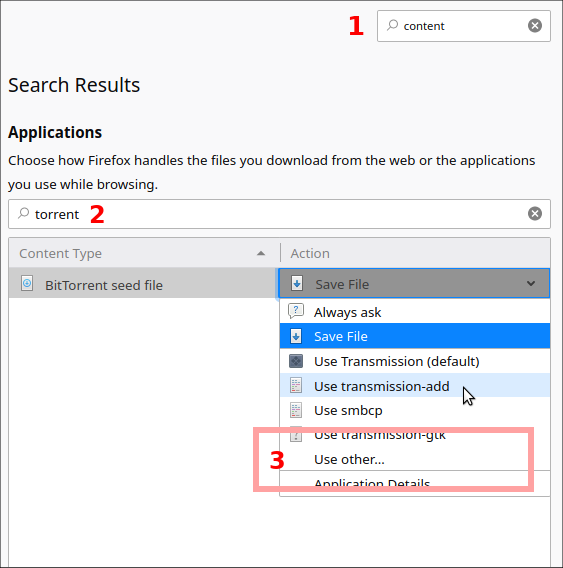

# Add a .torrent file to transmission in one-click

Shell wrapper for Linux, tested on xfce with `notify-send`.

Uses `transmission-remote` to add the given torrent to a remote `transmission-daemon`.
On graphical interface also use `notify-send` to inform with nice popup that the action
has performed well.

## Install

```
git clone https://github.com/Sylvain303/transmission-add.git
# if needed:
sudo apt-get install libnotify-bin transmission-cli
```

## Configuration

### Save your config

Put your value in `transmission.conf` in the same directory of the script.

```bash
# override config (this is bash code)
TRANSMISSION_ADDR=192.168.1.2
TRANSMISSION_PORT=9091
```

### Store your transmission-remote credential in a `.netrc`

Add a remote credential in your `~/.netrc` (`man netrc` for more details).
This is for automating usage of `transmission-remote`.

```netrc
machine 192.168.1.2
login transmission
password My_password_here_with_space_change_it_if_they_was_space_in_it
```

Test it:

```bash
transmission-remote $TRANSMISSION_ADDR:$TRANSMISSION_PORT -l
```

You should get a text list of your actually seeding torrent.

## Usage

```
transmission-add path/to/somefile.torrent
```

### Cool usage!

From FireFox add a torrent in one-click!

For example add [an .iso of your favorite GNU/Linux distribution](https://cdimage.debian.org/debian-cd/current/amd64/bt-cd/debian-10.3.0-amd64-xfce-CD-1.iso.torrent) to your local seedbox!

First, test that it works from command line.

Next, in FireFox:

1. Save the torrent file (and check the box to remember the decision for this type of content).
2. Modify in **preferences** > **Applications** look for "BitTorrent seed file".
3. Change the **Action** to **Use other** and browse to find the script `transmission-add`.



Now?

One click, save and download to your local seedbox, and share all those Linux images you love, and more!

Try again on a .torrent link in your browser, it should automaticliy download the .torrent and pass it to
`transmission-add` and a popup should raise informing that the torrent has been added.

Enjoy.

### Debug

If it doesn't work, that may help:

Look into `~/.mozilla/[your_local_path]/mimeTypes.rdf`, there should be an entry here for torrent.

